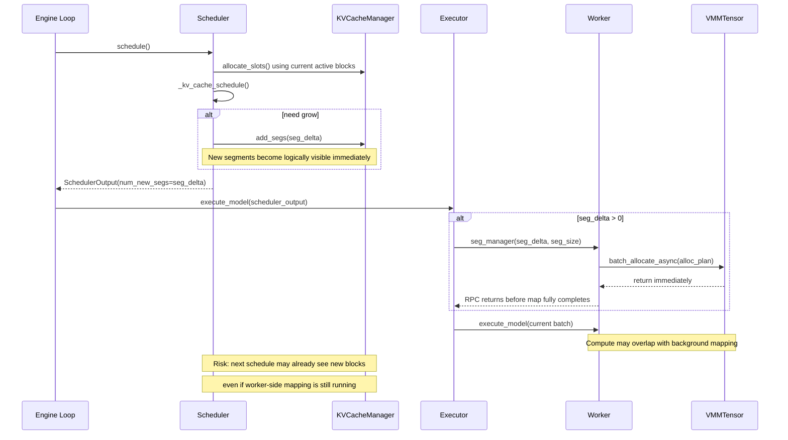
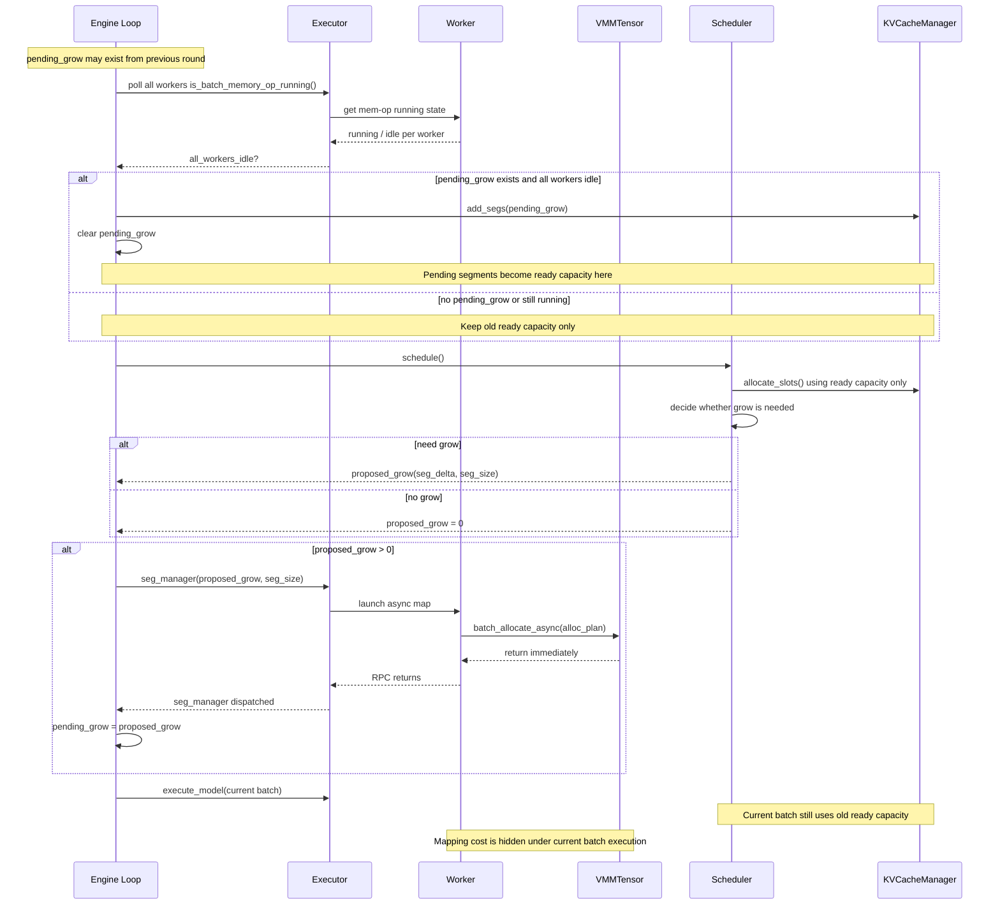
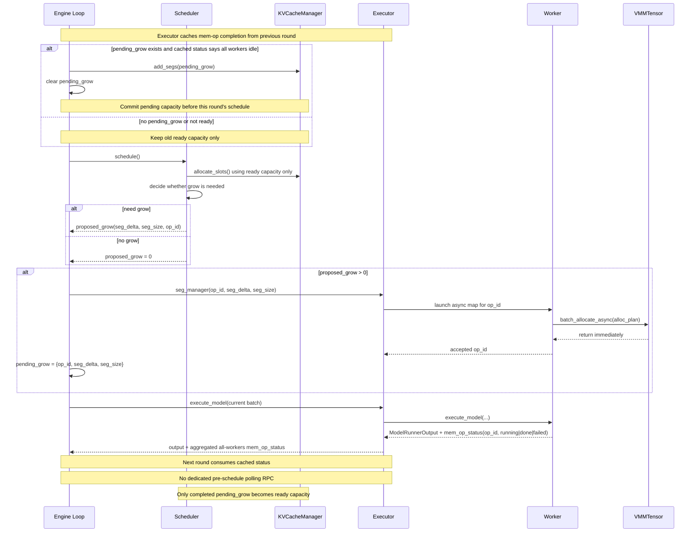

# Dynamic KV Cache Async Sequence Diagrams

本文整理了三种动态 KV cache 扩缩容方案的时序图：

1. 当前实现
2. 用户提出的 `pending_grow -> ready_grow` 方案
3. 在当前架构下更优的方案

重点关注 `grow` 路径，因为 `shrink` 的语义与 `grow` 不同，不适合混在同一张图里分析。

## 1. 当前实现

当前实现的问题不在于没有异步 map，而在于逻辑容量在 scheduler 内部过早提交，导致新 segment 在 worker 侧真实 map 完成前就已经对逻辑 block pool 可见。

### 关键特征

- `schedule()` 内直接 `add_segs()`
- worker 侧确实有异步 map
- 当前 batch 的 compute 有机会和后台 map 重叠
- 但新 block 可能在 map 完成前就被下一轮调度看见

## 2. 用户提出的方案

这个方案的核心思想是把 `grow` 拆成两个阶段：

- `pending_grow`：已经发起 worker 侧异步 map，但还不能给 scheduler 用
- `ready_grow`：确认 map 完成后，再正式 `add_segs()` 进入逻辑容量

### 关键特征

- `schedule()` 只产生 `proposed_grow`，不直接提交逻辑容量
- 当前 batch 继续使用旧的 ready capacity
- worker 侧异步 map 与当前 batch 推理重叠
- 下一轮开始前确认 map 完成后，再把 `pending_grow` 转成 `ready_grow`

### 这个方案的价值

- 修复当前实现里“逻辑容量暴露过早”的问题
- 保留异步 map 与推理重叠的能力
- 作为 MVP，状态机足够清晰，改动范围也相对可控

### 这个方案的不足

- 如果每轮 schedule 前都主动发起一次额外 RPC 轮询 worker，会带来固定控制面开销
- `is_batch_memory_op_running()` 只有布尔语义，只适合单批 inflight grow 的简单实现

## 3. 更优方案

更优方案保留用户提出的 `pending_grow -> ready_grow` 状态机，但进一步优化 readiness 信号的传递方式。

核心优化点：

- 不再每轮 schedule 前固定主动轮询 worker
- 由 worker 在 `execute_model` 返回路径里顺带上报内存操作状态
- executor 聚合并缓存这个状态
- 下一轮开始时直接消费缓存，而不是额外打一轮同步 RPC

### 关键特征

- 状态机与用户方案一致
- readiness 检查不再依赖每轮固定主动轮询
- 控制面开销更低
- 更适合作为长期演进方向

### 这个方案的代价

- 需要在 worker -> executor -> engine 的返回链路上携带额外状态
- 如果要支持多批 inflight grow，最好进一步引入 `op_id` 或 segment 级 completion 语义

## 三种方案对比

| 方案 | 正确性 | 开销隐藏能力 | 控制面开销 | 实现复杂度 |
|---|---|---|---|---|
| 当前实现 | 较弱 | 有雏形 | 低 | 低 |
| 用户方案 | 强 | 强 | 中 | 中 |
| 更优方案 | 强 | 强 | 更低 | 更高 |

## 结论

如果目标是：

- 修复当前实现的语义问题
- 尽量隐藏动态分配开销
- 保持改动可控

那么用户提出的 `pending_grow -> ready_grow` 方案，是当前代码基础上最合适的 MVP 方向。

如果目标是进一步减少控制面成本，并为后续更复杂的异步流水线做准备，那么更优方案更值得作为长期方向。

## 相关代码位置

- 当前 `schedule` 内直接 grow 的入口：`vllm/v1/core/sched/scheduler.py`
- 当前 `add_segs()` 的提交位置：`vllm/v1/core/sched/scheduler.py`
- 当前 executor 在推理前发 `seg_manager`：`vllm/v1/executor/multiproc_executor.py`
- 当前 worker 侧异步 map：`vllm/v1/worker/gpu_model_runner.py`
- 当前布尔状态接口：`vmm_tensor/vmm_tensor_refactor.cpp`
