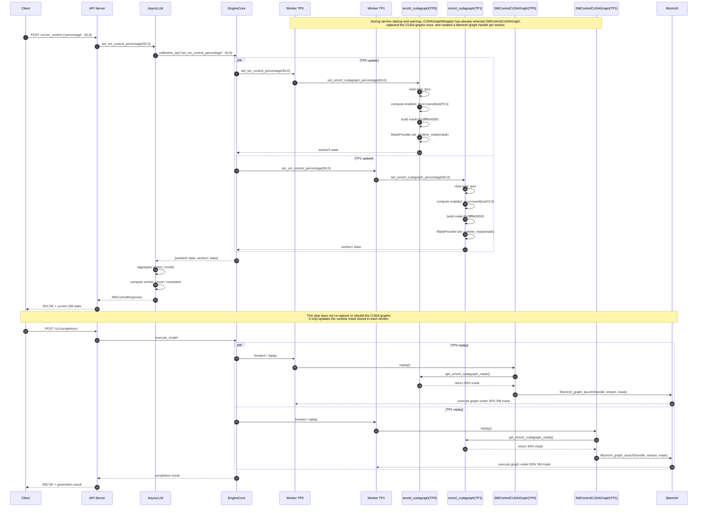

# vLLM + libsmctrl Context

Last updated: 2026-04-13

This file is the primary context handoff for the `vllm-graph` integration work.
If a future session needs to continue this work, read this file first.

## Goal

Integrate `libsmctrl` into `vLLM` so CUDA Graph replay can run under a
controlled SM/TPC mask on NVIDIA GPUs.

The intended control model is:

1. `vllm` captures/replays CUDA graphs through a `libsmctrl`-backed path.
2. SM capacity can be controlled either:
   - at startup with a fixed mask, or
   - at runtime via an HTTP request that sets an SM percentage.

## Environment

- Workspace root:
  `/home/llm/tli/libsmctrl`
- Conda env:
  `vllm-graph`
- Installed `vllm` location:
  `/home/llm/.conda/envs/vllm-graph/lib/python3.12/site-packages/vllm`
- Model used for testing:
  `/mnt/sdb/models/Qwen3-4B`
- Main test port:
  `10011`
- Test GPU:
  physical GPU 1, typically exposed with `CUDA_VISIBLE_DEVICES=1`

## Repository Layout

The codebase is now split into two GitHub repositories:

- `libsmctrl` repository:
  `git@github.com:lt2000/libsmctrl.git`
- paired `vLLM` fork:
  `git@github.com:lt2000/vllm.git`

Local working directories:

- `libsmctrl`:
  `/home/llm/tli/libsmctrl`
- `vLLM` fork:
  `/home/llm/tli/vllm-smctrl`

Important distinction:

- the current `vllm-graph` runtime environment still imports `vllm` from:
  `/home/llm/.conda/envs/vllm-graph/lib/python3.12/site-packages/vllm`
- the new source-of-truth fork for future development is:
  `/home/llm/tli/vllm-smctrl`
- changes made in `/home/llm/tli/vllm-smctrl` do not automatically affect the
  existing `vllm-graph` environment unless that environment is reinstalled from
  source or switched to an editable install

## GitHub Migration Status

### libsmctrl repository

- local git repository initialized in:
  `/home/llm/tli/libsmctrl`
- default branch:
  `main`
- artifact-heavy paths were kept on disk and ignored via `.gitignore`
  rather than deleted
- pushed branch:
  `origin/main`

Key local commits:

- initial import:
  `17f8fa4` `Initial import of libsmctrl sources`
- README update with paired-vLLM setup notes:
  `f72a88e` `Document vLLM repository relationship and setup`

### vLLM fork

- clean upstream `v0.10.1` checkout created in:
  `/home/llm/tli/vllm-smctrl`
- working branch:
  `smctrl-v0.10.1`
- current remotes:
  - `origin` -> `git@github.com:lt2000/vllm.git`
  - `upstream` -> `https://github.com/vllm-project/vllm.git`
- pushed branch:
  `origin/smctrl-v0.10.1`

Key local commits:

- baseline SM-control integration import:
  `fa1146b` `Add libsmctrl-backed CUDA Graph replay and SM control`
- README update with `libsmctrl` integration notes:
  `7a8f423` `Document libsmctrl integration and setup`

### GitHub SSH configuration used locally

Both local repositories were configured to use:

- SSH key:
  `/home/llm/.ssh/lt2000`

via repository-local `git config core.sshCommand` so that future pushes on this
machine use the `lt2000` GitHub identity instead of the previously active
account.

## Core libsmctrl fact

`libsmctrl` interprets a mask bit of `1` as "disable this TPC".

On the tested A40:

- total TPCs: `42`
- fixed 50% strategy uses first 21 TPCs enabled, remainder disabled
- startup mask for 50%:
  `0x3ffffe00000`

## What Was Modified In vLLM

The changes were made in-place inside the `vllm-graph` environment.

### Files modified

- `/home/llm/.conda/envs/vllm-graph/lib/python3.12/site-packages/vllm/smctrl_cudagraph.py`
- `/home/llm/.conda/envs/vllm-graph/lib/python3.12/site-packages/vllm/compilation/cuda_graph.py`
- `/home/llm/.conda/envs/vllm-graph/lib/python3.12/site-packages/vllm/worker/worker_base.py`
- `/home/llm/.conda/envs/vllm-graph/lib/python3.12/site-packages/vllm/worker/worker.py`
- `/home/llm/.conda/envs/vllm-graph/lib/python3.12/site-packages/vllm/v1/engine/async_llm.py`
- `/home/llm/.conda/envs/vllm-graph/lib/python3.12/site-packages/vllm/entrypoints/openai/protocol.py`
- `/home/llm/.conda/envs/vllm-graph/lib/python3.12/site-packages/vllm/entrypoints/openai/api_server.py`
- `/home/llm/.conda/envs/vllm-graph/lib/python3.12/site-packages/vllm/transformers_utils/tokenizer.py`

### Behavioral changes

1. Added `vllm.smctrl_cudagraph.SMControlCUDAGraph`
   - Uses CUDA runtime capture (`cudaStreamBeginCapture` /
     `cudaStreamEndCapture`) via `ctypes`
   - Preserves a source graph for `libsmctrl_graph_create`
   - Replays through `libsmctrl_graph_launch`

2. Modified `vllm.compilation.cuda_graph.CUDAGraphWrapper`
   - When `VLLM_SMCTRL_CUDAGRAPH_ENABLE=1`, it uses
     `SMControlCUDAGraph` instead of `torch.cuda.CUDAGraph`

3. Added runtime SM control helpers in `vllm.smctrl_cudagraph`
   - `set_smctrl_cudagraph_mask(...)`
   - `set_smctrl_cudagraph_percentage(...)`
   - `get_smctrl_cudagraph_state()`
   - device/TPC info caching

4. Added worker RPC surface
   - `WorkerBase.set_sm_control_percentage(...)`
   - `WorkerBase.get_sm_control_state()`

5. Added async engine helpers
   - `AsyncLLM.set_sm_control_percentage(...)`
   - `AsyncLLM.get_sm_control_state()`

6. Added HTTP endpoints
   - `GET /v1/sm_control`
   - `POST /v1/sm_control`

7. Added tokenizer compatibility fallback
   - `Qwen2Tokenizer` in this env lacks
     `all_special_tokens_extended`
   - `vllm/transformers_utils/tokenizer.py` now falls back to
     `all_special_tokens`

## SM Reconfiguration Sequence

The following sequence diagram describes how runtime SM reconfiguration works
for `POST /v1/sm_control`, and how the updated mask takes effect on the next
CUDA graph replay.



Key point:

- runtime SM reconfiguration updates the worker-local mask state
- the updated mask is consumed at replay time by
  `libsmctrl_graph_launch(handle, stream, mask)`
- the CUDA graph itself is not re-captured when only the SM mask changes

## Runtime Controls

### 1. Enable libsmctrl-backed CUDA graphs

```bash
export VLLM_SMCTRL_CUDAGRAPH_ENABLE=1
export VLLM_SMCTRL_LIBSMCTRL_SO_PATH=/home/llm/tli/libsmctrl/libsmctrl.so
```

### 2. Fixed SM mask at startup

Use this when you want a stable startup-time configuration and do not want to
change SM allocation dynamically.

Example: fixed 50% on the tested A40

```bash
export VLLM_SMCTRL_CUDAGRAPH_MASK=0x3ffffe00000
```

Then start `vllm`:

```bash
CUDA_VISIBLE_DEVICES=1 \
VLLM_SMCTRL_CUDAGRAPH_ENABLE=1 \
VLLM_SMCTRL_CUDAGRAPH_MASK=0x3ffffe00000 \
VLLM_SMCTRL_LIBSMCTRL_SO_PATH=/home/llm/tli/libsmctrl/libsmctrl.so \
conda run -n vllm-graph \
vllm serve /mnt/sdb/models/Qwen3-4B --port 10011 --max-num-seqs 512
```

### 3. Request-based runtime control

Current HTTP endpoint:

```bash
curl -s http://127.0.0.1:10011/v1/sm_control
```

Set by percentage:

```bash
curl -s http://127.0.0.1:10011/v1/sm_control \
  -H 'Content-Type: application/json' \
  -d '{"percentage": 50.0}'
```

Response includes:

- `requested_percentage`
- `effective_percentage`
- `total_tpcs`
- `enabled_tpcs`
- `mask`
- `worker_results`

### 4. Tensor-parallel runtime control

Runtime SM control also works when `vllm` is launched with tensor parallelism.
The `/v1/sm_control` request is dispatched collectively to all TP workers.

Validated example on physical GPUs 4 and 5:

```bash
CUDA_VISIBLE_DEVICES=4,5 \
VLLM_USE_V1=1 \
VLLM_SMCTRL_CUDAGRAPH_ENABLE=1 \
VLLM_SMCTRL_LIBSMCTRL_SO_PATH=/home/llm/tli/libsmctrl/libsmctrl.so \
conda run -n vllm-graph \
vllm serve /mnt/sdb/models/Qwen3-4B \
  --port 10021 \
  --tensor-parallel-size 2 \
  --max-num-seqs 8 \
  --max-model-len 2048
```

Check state:

```bash
curl -s http://127.0.0.1:10021/v1/sm_control
```

Set both TP workers to 50% SM:

```bash
curl -s http://127.0.0.1:10021/v1/sm_control \
  -H 'Content-Type: application/json' \
  -d '{"percentage": 50.0}'
```

Useful TP-specific response fields:

- `worker_count`
- `consistent`
- `worker_results`

Note:

- when `CUDA_VISIBLE_DEVICES=4,5`, vLLM worker-local `device_index` values are
  reported as `0` and `1`
- in the validated TP run, `worker_count=2` and `consistent=true`

## Strategy Used For Percentage -> Mask

Current strategy name:
`contiguous_prefix`

Meaning:

- detect total TPC count
- compute enabled TPC count by percentage
- enable the first `N` TPCs
- disable all later TPCs

This is simple and deterministic, but not topology-aware across GPCs.

## What Was Validated Successfully

### Runtime SM control

Request-based control worked on GPU 1:

- `GET /v1/sm_control` returned the expected state
- `POST /v1/sm_control` changed the effective mask
- timing changed in a way consistent with reduced compute
- restoring to 100% returned performance to baseline

Observed representative timing:

- 100%: about `1.96s`
- about 1 TPC enabled: about `22.7s`
- restored 100%: about `1.96s`

### vLLM service startup

`vllm serve /mnt/sdb/models/Qwen3-4B --port 10011 --max-num-seqs 512`
successfully ran with libsmctrl-backed CUDA graph replay enabled.

### Tensor parallel + runtime SM control

This was validated with:

- physical GPUs 4 and 5
- `CUDA_VISIBLE_DEVICES=4,5`
- `--tensor-parallel-size 2`
- `VLLM_USE_V1=1`

Observed behavior:

- the service started successfully with TP enabled
- `GET /v1/sm_control` returned `worker_count=2`
- the response reported `consistent=true`
- `POST /v1/sm_control` set both TP workers to 50% SM
- the effective 50% mask was `0x3ffffe00000` on both workers
- a minimal `/v1/completions` request succeeded while 50% SM was active
- restoring to 100% SM also succeeded

### TP=4 dynamic SM-setting overhead

This was measured in the `vllm-graph` environment on physical GPUs 2, 3, 4,
and 5 with:

- `CUDA_VISIBLE_DEVICES=2,3,4,5`
- `--tensor-parallel-size 4`
- `VLLM_USE_V1=1`
- `VLLM_SMCTRL_CUDAGRAPH_ENABLE=1`
- `VLLM_SMCTRL_LIBSMCTRL_SO_PATH=/home/llm/tli/libsmctrl/libsmctrl.so`

Measurement method:

- start `vllm serve` for the target model
- wait for `/health`
- send one minimal warmup `/v1/completions` request
- then, with the server idle, run 10 cycles of:
  - `POST /v1/sm_control {"percentage": 50.0}`
  - `POST /v1/sm_control {"percentage": 100.0}`
- record end-to-end HTTP latency for each `POST /v1/sm_control`

All three models returned:

- `worker_count=4`
- `consistent=true`

Observed overhead summary:

| Model | `/health` ready | Warmup request | Mean set-SM overhead | Mean set-to-50% | Mean set-to-100% |
| --- | ---: | ---: | ---: | ---: | ---: |
| `/mnt/sdb/models/Qwen3-4B` | `78.04s` | `124.39ms` | `3.53ms` | `3.54ms` | `3.52ms` |
| `/mnt/sdb/models/Llama-3.1-8B` | `72.04s` | `129.30ms` | `3.48ms` | `3.49ms` | `3.48ms` |
| `/mnt/sdb/models/llama-3.1-70B-Instruct` | `170.09s` | `675.72ms` | `3.69ms` | `3.93ms` | `3.45ms` |

Additional notes:

- for `Qwen3-4B`, the measured dynamic SM-setting latency ranged from
  `3.38ms` to `3.97ms`
- for `Llama-3.1-8B`, the measured dynamic SM-setting latency ranged from
  `3.38ms` to `3.73ms`
- for `llama-3.1-70B-Instruct`, the measured dynamic SM-setting latency ranged
  from `3.25ms` to `8.57ms`
- the `70B` run had one visible `set_50` outlier at `8.57ms`; the rest of the
  samples stayed near the same `3.3-3.7ms` band as the smaller models

Current interpretation:

- dynamic SM reconfiguration overhead is about `3.5ms` at `tp=4`
- this control-plane overhead did not materially scale with model size across
  `4B`, `8B`, and `70B`
- the results are consistent with the current design, where `POST /v1/sm_control`
  updates worker-local runtime mask state and the new mask is consumed on the
  next graph replay, rather than forcing CUDA graph re-capture

## Recommended Next Steps

If continuing from a future session, do this:

1. Read this file.
2. Re-read these generated notes:
   - `/home/llm/tli/libsmctrl/codex-log/vllm-smctrl-cudagraph-20260412-164607.md`
   - `/home/llm/tli/libsmctrl/codex-log/qwen3-4b-serve-gpu1-20260412-170013.md`
   - `/home/llm/tli/libsmctrl/codex-log/qwen3-4b-smctrl-verification-20260412-170000.md`
   - `/home/llm/tli/libsmctrl/codex-log/vllm-request-sm-control-20260412-172300.md`
3. Continue from the non-profiling validation path:
   - verify `GET /v1/sm_control`
   - verify `POST /v1/sm_control`
   - run one minimal inference request
   - compare behavior between 100% SM and reduced SM
4. Treat `/home/llm/tli/vllm-smctrl` as the development source-of-truth rather
   than patching `site-packages` in place.

## How To Sync Future vLLM Changes Into the Runtime Environment

Current state:

- the active `vllm-graph` environment still uses the installed package in
  `site-packages`
- a separate development environment now exists:
  `vllm-graph-dev`
- `vllm-graph-dev` keeps the compiled vLLM extensions from the cloned
  environment, but its Python source files in `site-packages/vllm` are
  symlinked to `/home/llm/tli/vllm-smctrl/vllm`
- this means edits to existing Python files under
  `/home/llm/tli/vllm-smctrl/vllm` now affect `vllm-graph-dev` immediately
  after process restart

Implemented approach:

- direct `pip install -e /home/llm/tli/vllm-smctrl` was attempted first
- on this machine, editable install failed because the build tried to
  recompile the full vLLM C++/CUDA extension stack and CMake failed at the
  `torch::nvtoolsext` / `CUDA::nvToolsExt` stage
- the working fallback is:
  - clone `vllm-graph` into `vllm-graph-dev`
  - keep the already-working binary extensions in that environment
  - replace non-`.so` files in
    `/home/llm/.conda/envs/vllm-graph-dev/lib/python3.12/site-packages/vllm`
    with symlinks to `/home/llm/tli/vllm-smctrl/vllm`

Recommended workflow:

1. Keep `/home/llm/tli/vllm-smctrl` as the only source-of-truth for future code
   changes.
2. Use the separate cloned environment `vllm-graph-dev` for development.
3. If new Python files are added to the source tree, rerun:
   `/home/llm/tli/vllm-smctrl/tools/sync_python_overlay_to_env.sh vllm-graph-dev`
4. Restart `vllm serve` in `vllm-graph-dev` after Python-side code changes.

Implemented commands:

```bash
conda create -n vllm-graph-dev --clone vllm-graph
/home/llm/tli/vllm-smctrl/tools/sync_python_overlay_to_env.sh vllm-graph-dev
conda run -n vllm-graph-dev python -c "import os, vllm, vllm.smctrl_cudagraph as sm; print(os.path.realpath(vllm.__file__)); print(os.path.realpath(sm.__file__))"
```

Verification result:

- `vllm.__file__` resolves to:
  `/home/llm/tli/vllm-smctrl/vllm/__init__.py`
- `vllm.smctrl_cudagraph.__file__` resolves to:
  `/home/llm/tli/vllm-smctrl/vllm/smctrl_cudagraph.py`
- `vllm._C.__file__` resolves to:
  `/home/llm/.conda/envs/vllm-graph-dev/lib/python3.12/site-packages/vllm/_C.abi3.so`

Notes:

- for the current Python-only SM-control changes, restarting the service in
  `vllm-graph-dev` is sufficient after editing the source tree
- if a change touches compiled extensions or build configuration, this symlink
  overlay method is not enough by itself; a real rebuild path will be needed
- avoid manually copying patched files into `site-packages` again unless doing
  a temporary emergency experiment

Development notes:

- modifying an existing Python file under `/home/llm/tli/vllm-smctrl/vllm`
  is enough to affect `vllm-graph-dev`
- those Python edits are not hot-reloaded into already-running processes;
  restart `vllm serve` or the relevant Python process after the change
- if a new Python file or module is added, rerun
  `/home/llm/tli/vllm-smctrl/tools/sync_python_overlay_to_env.sh vllm-graph-dev`
  before restarting the service
- this workflow only covers Python-source changes
- edits to C++/CUDA sources, `.so` extensions, `csrc/`, `CMakeLists.txt`,
  `pyproject.toml`, or other build-sensitive components still require a real
  rebuild strategy

## Current Service State

At the time this document was written, no `vllm` server is assumed to be
running on port `10011`. Re-check before starting work.
